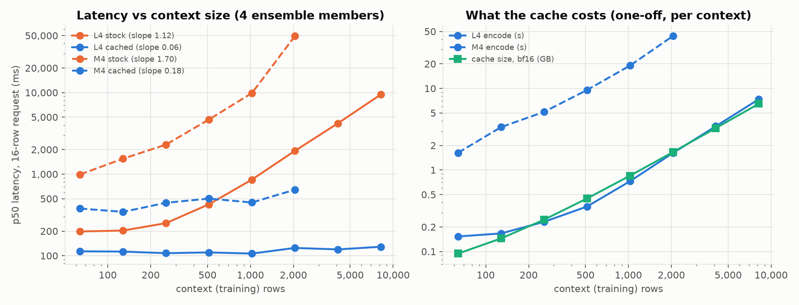
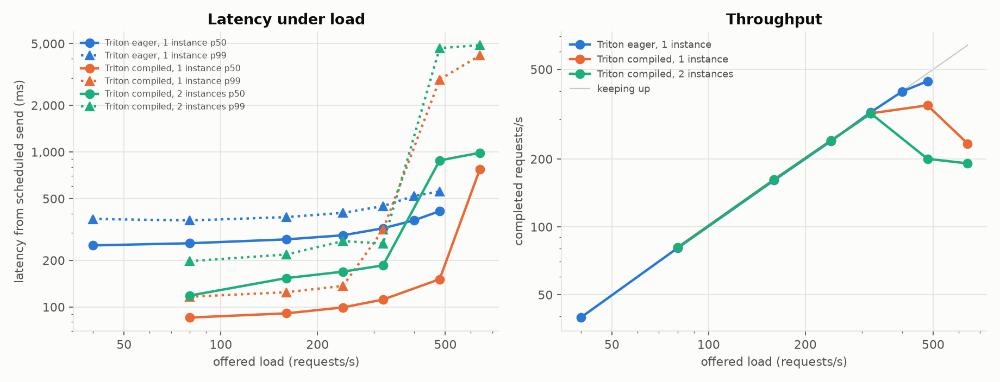

<div align="center">

<h2>TabFM re-reads its whole training table on every prediction. Can it still serve online requests in ~100 ms?</h2>

[](https://github.com/glukicov/ltm_serve/actions/workflows/ci.yml)
[](LICENSE)
[](.python-version)
[](https://github.com/astral-sh/uv)
[](https://github.com/astral-sh/ruff)
[](https://mypy-lang.org/)
<br>
[](https://github.com/google-research/tabfm)
[](https://pytorch.org)
[](https://github.com/triton-inference-server/server)
[](https://kserve.github.io/website/)
[](https://cloud.google.com/kubernetes-engine)

**[Results](#results) · [What's inside](#whats-inside) · [Quickstart](#quickstart) · [Layout](#layout) · [Licence](#licence) · [Why](MEDIUM_URL_TBD)**

</div>

**ltm-serve — online inference for a tabular foundation model.** A hands-on project that takes Google's
[TabFM](https://github.com/google-research/tabfm), a 1.64B-parameter in-context tabular model, from "a
`predict_proba` call in a notebook" to low-latency online serving: measure it properly, optimise the model, then
serve it three ways (FastAPI, Triton, KServe) on a laptop and on an NVIDIA L4 in GKE.

TabFM learns *in context*: every call sends the labelled training rows and the rows to predict through a 24-layer
transformer together. That means no training step, but an online service built on stock TabFM pays for the whole
context on every request. The fix turns out to be exact, and most of this repo is about what comes after it.

<!-- TODO: replace MEDIUM_URL_TBD (here, in the nav above and in the footer) with the Medium article URL. -->
The story behind it: **[Medium article — link coming soon](MEDIUM_URL_TBD)** 📖
<br>
Not a reader? **[Slides](docs/slides/inference-lessons-2026-09-13.html)** 🎞️ — GitHub shows HTML as source, so
[view them in the browser](https://htmlpreview.github.io/?https://github.com/glukicov/ltm_serve/blob/main/docs/slides/inference-lessons-2026-09-13.html)
or download the file and open it locally.

**The full write-up is [`docs/WRITEUP.md`](docs/WRITEUP.md)**: every phase, every number, and why.

## Results

All serving numbers are from **one NVIDIA L4 (24 GB)** on GKE, bf16, with the open-loop load generator running
in-cluster.

### ⚡ Model-level optimisation

| Optimisation on the L4 | Before | After |
|---|---:|---:|
| **Exact context (KV) cache** — 16-row request, 8,192 context rows, 4 members | 9.47 s | **129 ms (74×)** |
| **`torch.compile` + CUDA graphs** on the cached forward — 1-row request, 512 context rows, p50 / p99 | 111 / 134 ms | **28 / 33 ms** |
| **Batch ensemble members** in one forward — 16 members, 1-row request | 1,137 ms | **230 ms (5×)** |

The cache is exact, not an approximation: it matches stock TabFM to ≤3e-6 in fp32 on CPU, MPS and CUDA. With it,
latency no longer depends on context size (log-log slope 1.12 → 0.06).



### 🚦 Serving on 1× L4

1,024 context rows, 10 features, 8 members, 1-row requests over the Open Inference Protocol v2.

| Stack | p50 / p99 at 160 req/s | Knee |
|---|---:|---:|
| FastAPI, continuous batcher, eager | 314 / 673 ms | ~285 req/s |
| FastAPI, compiled | 97 / 137 ms | ~230 req/s |
| Triton, 1 instance, eager | 262 / 378 ms | ~160 req/s |
| Triton, 2 instances on the same GPU, eager | 266 / 410 ms | ~300 req/s |
| **Triton, 1 instance, compiled** | **91 / 125 ms** | **~350 req/s** |
| Triton, 2 instances, compiled | 154 / 218 ms | ~320 req/s |

- **Compiling cut latency ~3× and moved the bottleneck.** Compiled FastAPI's knee *dropped*, because one Python
  process (1.05 cores) became the ceiling; Triton's C++ front end keeps request handling out of the model process.
- **The right instance count flipped.** Eager, a second Triton instance doubled capacity (host Python was the limit);
  compiled, it made things worse (the GPU was the limit).
- **Cold start is the price.** From zero GPU nodes an eager Triton replica took **7 min 12 s** to become Ready
  (3 m 31 s of it pulling a 13.6 GB image); capturing the compiled shape buckets added a **20–23 min** warm-up per
  cold replica.



> [!IMPORTANT]
> **Caveats.** One L4, one context shape, 1-row requests: the knees and tails describe this setup, not a general
> benchmark. The tables are **synthetic** (latency depends on table shape, not content; the ensemble-size quality
> finding is about these tasks only). The Apple M4 numbers in the write-up were taken under swap pressure and show
> trends, not SLOs. In bf16, "exact" means within stock TabFM's own batch-composition noise, with 100% label
> agreement. TabFM's pretrained weights are licensed for **non-commercial use only**: fine for learning and
> benchmarking, not for production.

## What's inside

Each phase of [`docs/WRITEUP.md`](docs/WRITEUP.md) says what was built, what was measured and what it taught.

| Phase | What it adds | Headline |
|---|---|---|
| [0. Measure properly](docs/WRITEUP.md#2-phase-0-measure-properly) | Benchmark harness, named sweeps, a bf16 noise floor, per-stage timing | Which stage dominates depends on the table's shape |
| [1. Model-level optimisation](docs/WRITEUP.md#3-phase-1-model-level-optimisation) | Exact context cache, member batching, `torch.compile` with shape buckets, precision per device | 74× at 8,192 context rows; 111 → 28 ms compiled |
| [2. Online service and load testing](docs/WRITEUP.md#4-phase-2-an-online-service-and-load-testing) | FastAPI with a context registry, exact continuous batcher, Prometheus, OIP v2; an open-loop load generator | The load generator was the first bottleneck |
| [3. Triton Inference Server](docs/WRITEUP.md#5-phase-3-triton-inference-server) | Python backend, dynamic batching, "context as model", explicit model control | 1 → 2 instances in 22.5 s, no pod restart |
| [4. KServe on kind and GKE](docs/WRITEUP.md#6-phase-4-kserve-on-kubernetes) | InferenceServices for both stacks, weights from PVC / GCS, Workload Identity, KEDA | Cold start from zero GPU nodes: 7 min 12 s |
| [5. GPU serving on GKE](docs/WRITEUP.md#7-phase-5-gpu-serving-on-gke) | Eager vs compiled, FastAPI vs Triton, autoscaling under load | Compiled Triton: p50 / p99 91 / 125 ms at 160 req/s |
| [6. Inference architecture](docs/WRITEUP.md#8-phase-6-inference-architecture-strategy) | A design-review decision doc and a capacity model built from the measurements | 1,000 req/s at p99 < 150 ms: 5 + 1 L4s |
| [Everything that went wrong](docs/WRITEUP.md#10-everything-that-went-wrong) | Every problem hit along the way, with its symptom and fix | GPU quota, not the autoscaler, blocked scale-out |

The laptop phase (CPU containers, kind + KServe) has its own log: [`docs/local_phase.md`](docs/local_phase.md).

## Quickstart

Requirements: [uv](https://docs.astral.sh/uv/) (Python 3.14 is pinned in `.python-version`). Local runs work on
Apple silicon (`mps`), CUDA or CPU.

```bash
git clone https://github.com/glukicov/ltm_serve && cd ltm_serve
uv sync --all-extras
uv run pytest -m "not slow"          # fast tests, no weights needed
uv run pytest -m slow                # cache == stock TabFM (downloads 6.6 GB of weights once)
```

### 💻 Local: benchmark and serve

```bash
uv run ltm-serve bench context_scaling --device mps      # or cuda / cpu; results land in results/*.parquet
uv run ltm-serve plots                                   # figures -> docs/figures/

# the online service with a synthetic demo context, then load it
LTM_DEVICE=mps LTM_DEMO_CONTEXT="demo:n_train=512,n_features=10,n_classes=2,n_estimators=4" \
  uv run uvicorn ltm_serve.service.app:app --port 8080
uv run python -m ltm_serve.loadgen --url http://localhost:8080 --model demo --rates 1,2,4 --duration 30
```

### 🐳 kind + KServe (CPU)

```bash
uv run ltm-serve export-checkpoint ~/.cache/ltm_serve/checkpoints/tabfm-fp32 --dtype fp32
docker build -f docker/service.Dockerfile -t ltm-serve:cpu .
docker build -f docker/triton.Dockerfile -t ltm-triton:cpu .     # optional; the NGC base image is ~27 GB
k8s/kind/up.sh                       # cluster, cert-manager, KServe, KEDA, Prometheus; loads the images
kubectl --kubeconfig ~/.kube/ltm-serve --context kind-ltm apply -f k8s/kserve/isvc-fastapi-cpu.yaml
```

> [!TIP]
> Every script uses a dedicated kubeconfig (`~/.kube/ltm-serve`, override with `LTM_KUBECONFIG`) and names its
> context explicitly, so whatever context your shell has selected is left alone.

### ☁️ GKE with an L4

```bash
export PROJECT=<your-gcp-project-id>   # otherwise the active gcloud project is used
k8s/gke/up.sh                          # cluster + L4 pool from zero, KServe, KEDA, Prometheus, Cloud Build, weights bucket
k8s/gke/run.sh k8s/gke/isvc-triton-gpu.yaml
k8s/gke/run.sh k8s/gke/job-loadgen.yaml NAME=triton URL=http://tabfm-triton-predictor.ltm.svc.cluster.local \
  MODEL=tabfm INPUT_NAME=ROWS RATES=40,80,160,240 PROCS=4 CLIENT_CPU=4 LOADGEN_POOL=l4
k8s/gke/experiment-compiled.sh         # optional: redeploy both stacks compiled and rerun the load test
k8s/gke/down.sh                        # delete everything billable
```

> [!NOTE]
> **The GKE path costs money.** The L4 pool scales from zero, so the GPU is billed only while an L4 pod is
> scheduled (roughly $0.85/h for an on-demand `g2-standard-8` in us-central1; check current pricing). The system
> node, Cloud Build, the Artifact Registry images (the Triton image alone is 12.8–13.6 GB) and the weights bucket
> cost money for as long as they exist, and a compiled replica takes ~24–28 min to become Ready.
> **`k8s/gke/down.sh` deletes the cluster, the image repository, the bucket and the Cloud Build sources** — run it
> when you are done.

## Layout

```
src/ltm_serve/
  model.py              loading on cpu/mps/cuda, honest device sync, pre-cast bf16 checkpoint export
  context_cache.py      exact context (KV) cache: encode training rows once, serve queries against it
  bench.py, sweeps.py   benchmark harness and named sweeps -> results/*.parquet
  plots.py              figures -> docs/figures/
  service/              FastAPI: context registry with a memory budget, exact batcher, Prometheus, OIP v2
  loadgen.py            open-loop (Poisson) load generator for the native and v2 APIs
triton_models/          Triton Python-backend model with dynamic batching
docker/                 CPU (arm64) and CUDA (amd64) images; requirements.sh regenerates pins from uv.lock
k8s/kind/, k8s/kserve/  local kind cluster + KServe InferenceServices (custom container and Triton runtime)
k8s/gke/                GKE with an L4 pool from zero, Cloud Build, GPU InferenceServices, bench/load pods
tests/                  harness and batcher tests; -m slow runs the real model (cache == stock, HTTP end to end)
results/                the measured sweeps and load tests behind every table and figure
docs/                   WRITEUP.md, local_phase.md, figures/, slides/
data/penguins.csv       Palmer Penguins, a real table with categorical columns for the exactness tests
.github/workflows/      CI: ruff, mypy, pytest, shellcheck
CONTRIBUTING.md         setup, checks and what is easy to break
```

## Licence

The code in this repository is [Apache-2.0](LICENSE)-licensed, as is the tabfm code. The pretrained TabFM weights
are **not** covered by it: they are non-commercial. That's fine for learning and benchmarking; don't use them in
production.

**Data:** `data/penguins.csv` is the Palmer Penguins dataset (Gorman, Williams & Fraser, 2014, Palmer Station
Antarctica LTER; distributed via the [palmerpenguins](https://allisonhorst.github.io/palmerpenguins/) package, CC0).
Every other table is synthetic.

## Development

The toolchain ([Ruff](https://docs.astral.sh/ruff/), [mypy](https://mypy-lang.org/) in strict mode and
[pytest](https://docs.pytest.org/)) is pinned in `uv.lock`:

```bash
uv sync --all-extras
uv run ruff check . && uv run ruff format --check .
uv run mypy src tests
uv run pytest -m "not slow"
git ls-files -z '*.sh' | xargs -0 shellcheck && shellcheck k8s/gke/kctl
```

CI runs the same checks on every push and pull request, with CPU-only PyTorch wheels so it never downloads CUDA.
See [CONTRIBUTING.md](CONTRIBUTING.md).

<div align="center">
<br>

**[Results](#results) · [Write-up](docs/WRITEUP.md) · [Slides](docs/slides/inference-lessons-2026-09-13.html) · [Article](MEDIUM_URL_TBD) · [TabFM](https://github.com/google-research/tabfm)**

</div>
