# Serving TabFM online: benchmark, optimise, deploy

This write-up covers a hands-on project: take [TabFM](https://github.com/google-research/tabfm), a pre-trained
tabular foundation model, and serve it online with low latency on the stacks common in production model serving:
Triton, KServe, Kubernetes, plus a plain FastAPI baseline. Every number here was measured in this repo, and the
commands to reproduce it are in the linked files.

**Hardware.** An Apple M4 laptop (Mac GPU via PyTorch MPS, plus CPU), and one NVIDIA L4 (24 GB) on GKE. The L4 is
the reference for serving numbers. The Mac's unified memory was under swap pressure for the whole project, so its
latencies are only good for spotting trends, not for SLOs (see [Measurement caveats](#measurement-caveats)).

---

## TL;DR

| | Result |
|---|---|
| Biggest win | An **exact context (KV) cache**: encode the training rows once per context, then each request pays only for its own rows. On the L4 a 16-row request with 8,192 context rows went **9.47 s → 129 ms (74×)**. Latency no longer depends on context size (log-log slope 1.12 → 0.06). |
| Second win | **`torch.compile` + CUDA graphs** on the cached forward: **111 ms → 28 ms** p50 for a 1-row request (p99 134 → 33 ms). The eager floor was kernel-launch overhead, not GPU compute. |
| Third win | **Batch everything that's independent**: ensemble members in one forward (5× vs the library default of one at a time), and concurrent requests in one batch (exact, because query rows never attend to each other). |
| Serving on 1× L4 (eager baseline) | FastAPI's continuous batcher saturates at **~285 req/s**. Triton with 1 instance at **~160 req/s** (GIL-bound Python backend using 1 CPU core, GPU ~30% utilised), and with 2 instances on the same GPU at **~300 req/s**, with the best tail latency (p99 443 ms at 240 req/s). |
| Kubernetes | KServe (Standard mode) on GKE, weights pulled from GCS, KEDA autoscaling on in-flight requests. **Cold start from zero: 7 min 12 s**, half of it the 13.6 GB image pull. A warm restart takes ~1 min. KEDA asked for a second replica in 28 s; GPU quota (not the autoscaler) blocked it. |
| Validation | The cache matches stock TabFM to ≤3e-6 in fp32 on CPU, MPS and CUDA, with 100% of labels identical. In bf16, cached and compiled outputs are within stock TabFM's own batch-composition noise (100% label agreement). The HTTP service is tested end to end against stock TabFM with the real model; both stacks run and agree under Docker, kind + KServe and GKE + KServe. |
| **Optimising the deployed system** | Redeployed both stacks with compilation. **Compiled Triton, 1 instance: p50 91 ms / p99 125 ms at 160 req/s, knee ~350 req/s** (eager: 262 / 378 ms, ~160 req/s). Compiled FastAPI: 97 / 137 ms at 160 req/s, but its knee *dropped* to ~230 req/s because one Python process (1.05 cores) became the ceiling. With compilation, a second Triton instance made things *worse*: the bottleneck moved from host Python to the GPU. The price was a 20–23 min compile warm-up per cold replica (206 s with the compile cache reused). |

---

## Contents

1. [What TabFM is and why online serving is hard](#1-what-tabfm-is-and-why-online-serving-is-hard)
2. [Phase 0: measure properly](#2-phase-0-measure-properly)
3. [Phase 1: model-level optimisation](#3-phase-1-model-level-optimisation)
4. [Phase 2: an online service and load testing](#4-phase-2-an-online-service-and-load-testing)
5. [Phase 3: Triton Inference Server](#5-phase-3-triton-inference-server)
6. [Phase 4: KServe on Kubernetes (kind and GKE)](#6-phase-4-kserve-on-kubernetes)
7. [Phase 5: GPU serving results on GKE](#7-phase-5-gpu-serving-on-gke)
8. [Phase 6: inference architecture strategy](#8-phase-6-inference-architecture-strategy)
9. [TorchServe and TensorFlow Serving](#9-torchserve-and-tensorflow-serving)
10. [Everything that went wrong (and what it taught)](#10-everything-that-went-wrong)
11. [Measurement caveats](#measurement-caveats)
12. [Reproduce](#reproduce)

---

## 1. What TabFM is and why online serving is hard

TabFM predicts by **in-context learning**. `fit()` trains nothing: it fits encoders and stages the training table.
`predict_proba()` then feeds *training rows + query rows* through a transformer, and the query rows read labels off
the training rows, the way an LLM uses few-shot examples.

What reading `tabfm/src/pytorch/model.py` revealed, and why it matters for serving:

- **It is large.** The classification checkpoint has **1.64B parameters**: 6.6 GB in fp32, 3.3 GB in bf16. Almost
  all of it is a **24-layer in-context encoder at width 2048**.
- **Four stages per ensemble member.** A cell embedder, a column set-transformer (256 inducing points), a row
  transformer across columns, then the in-context encoder across rows. Stock inference runs **32 ensemble members**
  by default (feature shuffles, class shifts, normalisations), **one member per forward pass**.
- **Every call re-reads the whole training table.** Stock `predict_proba` sends `n_train + n_query` rows through all
  24 layers for every request. For an online service, that means paying for the context over and over.

The property that makes serving tractable:

> Every attention that mixes rows masks its keys to the **training rows only**: the column set-transformer's
> inducing points attend to training rows, and the in-context encoder lets every row attend to training rows. All
> other operations are per-row.

So (a) the training rows' hidden states never depend on the queries, and (b) query rows never influence each other.
(a) makes an **exact KV cache** possible; (b) makes **dynamic batching of unrelated requests exact**.

## 2. Phase 0: measure properly

**Built:** `src/ltm_serve/bench.py` (harness), `sweeps.py` (named sweeps), `data.py` (synthetic tables of exact
shape plus penguins), `plots.py` (figures). Results go to parquet (`results/` for the M4, `results/cuda/` for the L4).

The rules the harness enforces, each of which caught a real mistake during the project:

1. **Load once, warm up, synchronise.** GPU calls return before the work is done, so the clock is read only after
   `torch.cuda.synchronize()` / `torch.mps.synchronize()`. Warm-up calls absorb allocator growth and kernel selection.
2. **Percentiles over repeats**, not single runs.
3. **Quality next to latency.** Accuracy and log loss on held-out rows, because a speed-up that changes predictions
   isn't a speed-up.
4. **A noise floor before claiming exactness.** In bf16, stock TabFM's own outputs change when you only change which
   rows share a batch (L4: max |Δp| = 0.013). Cached-vs-stock (0.034) is the same order of magnitude, with 100%
   label agreement. In fp32 both are ≤3e-6. That's how "exact up to floating point" was established rather than
   assumed (`bench.bf16_noise_floor`).
5. **Isolate the machine.** A process from another session competed with the first round of Mac sweeps and
   inflated latencies by 2–7×. Those results are kept as `*_contended.parquet` and were re-run.

**Where stock time goes** (`stages` sweep, hooks timing each top-level module):

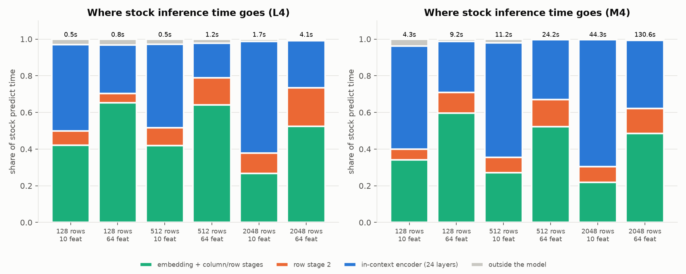

With 10 features the in-context encoder takes 45–61% of the time on the L4 (56–69% on the M4). With 64 features,
the column and row stages take 69–78%, because width enters the row transformer quadratically and the column stage
linearly. **So which optimisation matters depends on the shape of the data**, which is the point of sweeping each
axis separately.

## 3. Phase 1: model-level optimisation

### 3.1 The exact context cache (`src/ltm_serve/context_cache.py`)

`encode_context` runs the training rows through the model once and keeps, per ensemble member:

- the inducing-point states of each column set-transformer block (2 stages × 3 blocks), and
- the key/value projections of the training rows in each of the 24 in-context layers.

`forward_with_cache` then runs query rows through the per-row stages and cross-attends into those caches.
`CachedTabFMClassifier` wraps a fitted `TabFMClassifier` and reuses its preprocessing, ensembling, class-shift
correction and logit averaging, so the only thing that changes is which rows go through the transformer.

**Correctness.** `tests/test_context_cache.py` compares against stock TabFM on penguins (categorical columns) and a
padded 23-feature, 4-class synthetic task, with members batched and one at a time. It also checks that predicting
rows together equals predicting them one by one (the basis for exact dynamic batching). fp32 max |Δp|: 2.6e-6
(CPU), 2.2e-6 (MPS), 3e-6 (L4).

**Latency vs context size**, 16-row request, 4 members:


| Context rows | L4 stock | L4 cached | Speed-up | One-off encode (L4) | Cache (bf16) |
|---:|---:|---:|---:|---:|---:|
| 64 | 198 ms | 113 ms | 1.8× | 0.15 s | 94 MB |
| 512 | 427 ms | 110 ms | 3.9× | 0.36 s | 447 MB |
| 2,048 | 1,930 ms | 125 ms | 15× | 1.6 s | 1.65 GB |
| 8,192 | 9,470 ms | 129 ms | **74×** | 7.4 s | 6.49 GB |

- **Stock cost scales ~linearly (slope 1.12) on the L4, not quadratically.** At width 2048 the feed-forward layers
  dominate until attention's T² term catches up, somewhere around 10⁴ rows. On the M4 the slope is 1.70: MPS falls
  back to an unfused attention kernel for boolean masks, so the quadratic term shows up early.
- **Cached cost is flat (slope 0.06).** Per request you pay O(query rows × context rows) in attention, which is tiny
  next to the per-row feed-forwards.
- **The cache costs memory: ~198 KB per context row per ensemble member** in bf16 (24 layers × K and V × 2048 dims
  × 2 bytes, plus the inducing-point states). 8,192 rows × 32 members would be ~52 GB. **Cache memory, not the
  weights, is what limits how many contexts one GPU can hold**, which shapes the architecture in §8.

### 3.2 The other axes

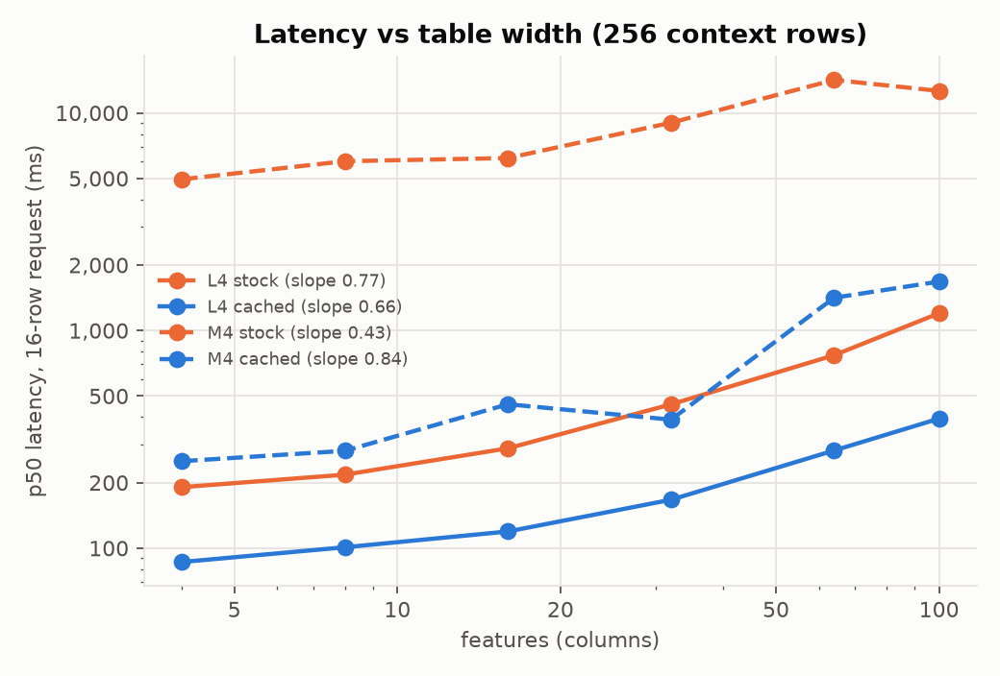 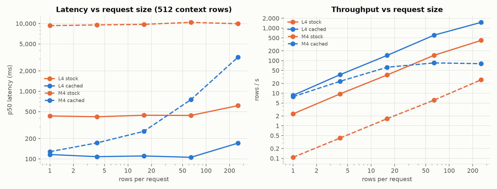

- **Width** (256 context rows): L4 cached 86 → 394 ms from 4 → 100 features. Stock 191 → 1,201 ms. Wide tables stay
  expensive even with the cache, because row and column stages run per query row.
- **Rows per request** (512 context rows): L4 cached latency is flat from 1 to 64 rows (105–116 ms) and reaches
  171 ms at 256 rows, i.e. **1,497 rows/s vs 418 rows/s for stock**. That flat region is why batching requests pays.
- **Classes** cost nothing in latency (only the decoder width changes). Accuracy drops with more classes on a fixed
  context (0.99 → 0.85), which is a data effect.

### 3.3 Ensemble size: the accuracy-for-latency dial

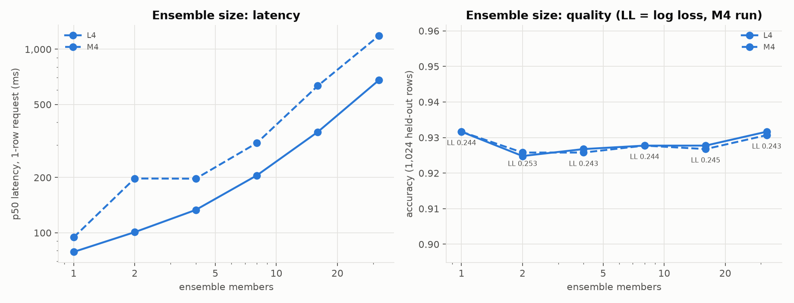

On a harder synthetic task (512 rows, 20 features, 5 classes), L4 latency grows from 79 ms (1 member) to 678 ms
(32 members), while **accuracy stays at 0.925–0.932 and log loss at 0.243–0.253**. Here, extra members buy nothing.
That's data-dependent: the default of 32 is tuned for leaderboard accuracy on diverse benchmarks. The operational
lesson is to **measure quality against ensemble size on the real data before paying 8.6× latency for it**.

### 3.4 Batching ensemble members

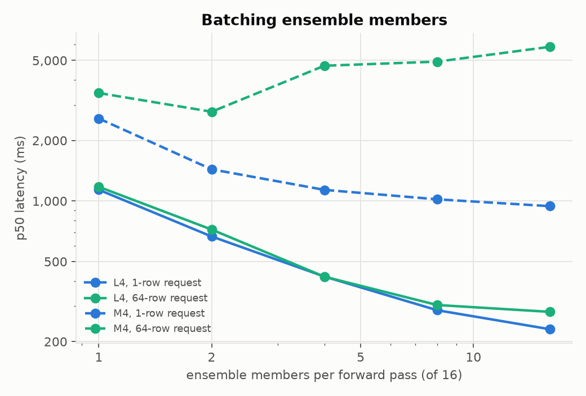

The library default `batch_size=1` runs members one at a time. On the L4, with 16 members and a 1-row request:
**1,137 ms one at a time → 230 ms all in one forward (5×)**. The GPU is mostly idle between small kernels, so fewer,
larger kernels win. (The M4 shows the same trend, but more noisily.)

### 3.5 Where a cached request's time goes, and compiling it away

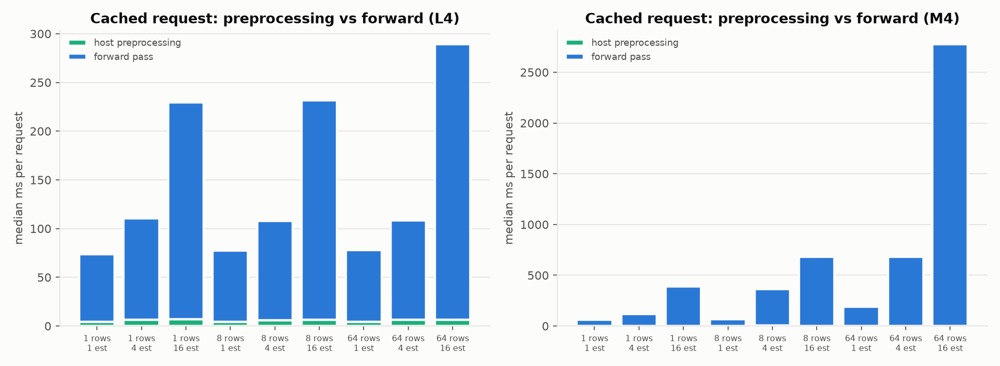

Once cached, host-side preprocessing (sklearn transforms, pandas) costs only **4–7 ms**; the forward pass is
70–280 ms. Because the forward barely moves between 1 and 64 rows, most of that time is **Python dispatch and
kernel launches** (24 layers × dozens of ops × members), not arithmetic. That's what compilation removes:

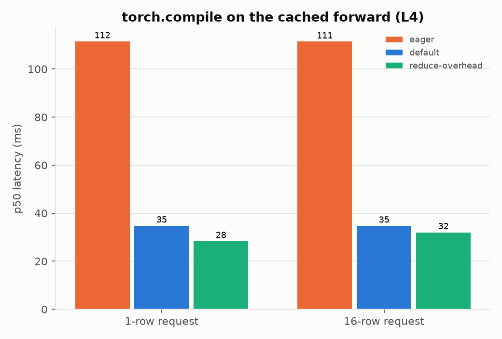

| Cached forward on L4 (512 rows, 4 members) | p50, 1-row request | p99, 1-row request | p50, 16-row request |
|---|---:|---:|---:|
| eager | 111.5 ms | 133.7 ms | 111.4 ms |
| `torch.compile` (default) | 34.8 ms | 41.6 ms | 34.7 ms |
| `torch.compile` (reduce-overhead = CUDA graphs) | **28.3 ms** | **32.6 ms** | 32.0 ms |

Compiled graphs (and especially CUDA graphs) are specialised to input shapes, so query rows are **padded to
power-of-two buckets** (`bucket_rows=True`, exact because rows are independent), and every bucket is **warmed up
before the service reports ready** (`CachedTabFMClassifier.warm_up`). Otherwise the first requests of each new shape
would pay seconds of compilation in production.

**Compiled outputs are still exact.** 1,024 context rows × 8 members, 256 query rows fed through bucketed batches
of 37 rows, bf16 on the L4:

| Comparison | max \|Δp\| | label agreement |
|---|---:|---:|
| eager cache vs stock TabFM | 0.032 | 100% |
| `compile` (default) vs eager cache | 0.042 | 100% |
| `compile` (reduce-overhead) vs eager cache | 0.017 | 100% |

All of these are within bf16 kernel noise (§2).

**The price is warm-up.** In this standalone check, `compile` (default mode) for the 9 row buckets (1…256) took
**433 s** in a fresh process. In the deployed services, reduce-overhead capture of the same buckets took 20–23 min
(§6, §7.2). The
reduce-overhead run right after took 2 s only because it reused the in-process compile cache. A compiled replica
therefore adds minutes to cold start unless the compile cache is persisted (`TORCHINDUCTOR_CACHE_DIR` on a volume,
or pre-built cache artifacts baked into the image), or the shapes are made dynamic (one graph instead of nine, at
some loss of specialisation).

### 3.6 Device and precision

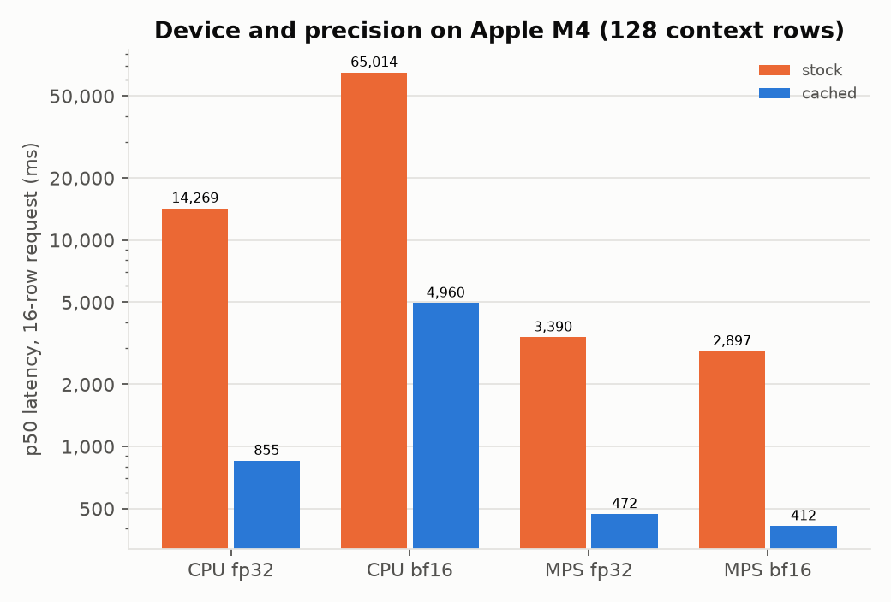

On the M4 **CPU, bf16 is 5–11× slower than fp32** (cached 4.96 s vs 0.85 s; stock 65 s vs 14 s): ARM CPUs have no
fast bf16 matrix kernels, so the model's default precision is the wrong choice there. On the Mac GPU, bf16 and fp32
are close. **Precision is a per-target decision**: bf16 on the L4, fp32 on ARM CPUs.

**Cold-start optimisation.** `ltm-serve export-checkpoint` writes the already-cast weights and config once.
`load_model(checkpoint_dir=...)` builds the module on the meta device and assigns tensors directly: no fp32
materialisation, half the download for bf16, half the peak RAM. On the L4 pod, weights plus context encode took
20–25 s.

## 4. Phase 2: an online service and load testing

**Built:** `src/ltm_serve/service/` (FastAPI) and `src/ltm_serve/loadgen.py`.

Design decisions:

- **A context is a first-class resource.** `POST /v1/contexts` registers a training table and returns an id;
  predictions reference it. An in-context model's "model" is weights + table, so the API makes that explicit.
- **Contexts live in an LRU bounded by cache bytes**, not a count, because cache memory is the binding constraint
  (§3.1). Evictions are counted in Prometheus.
- **An exact continuous batcher per context.** It takes the first queued request, then merges everything that
  arrived while the GPU was busy (or waits up to `LTM_MAX_DELAY_MS`), capped at `LTM_MAX_BATCH_ROWS` so batches stay
  within warmed-up compiled shapes.
- **One executor thread per process** for the accelerator, so work from different contexts is serialised rather
  than contending on the device.
- **Two APIs over one engine:** native JSON, and the **Open Inference Protocol v2** (`/v2/models/{id}/infer`), the
  same tensor API Triton and KServe use, so one load generator drives all three stacks with identical payloads.
- **Metrics:** request latency, queue wait, per-batch inference time, batch size in rows and in requests,
  in-flight requests (the autoscaling signal), cache bytes, evictions.

**Load generator.** It is open-loop: requests are scheduled on a Poisson clock at the offered rate, and latency is
measured **from the scheduled send time**. A closed-loop tool, where N workers each wait for a reply, slows down
exactly when the server does and hides queueing delay ("coordinated omission"). Request bodies are pre-serialised,
and the client runs across processes (`--procs`).

**The client was the bottleneck first.** With one client process, Triton looked like it collapsed at 160 req/s
(43 req/s completed, p50 4.9 s). But Triton's own metrics showed an empty queue and a GPU at 30%. The fix was
pre-serialised bodies and 3–4 client processes, after which the same server held 160 req/s at p50 262 ms:

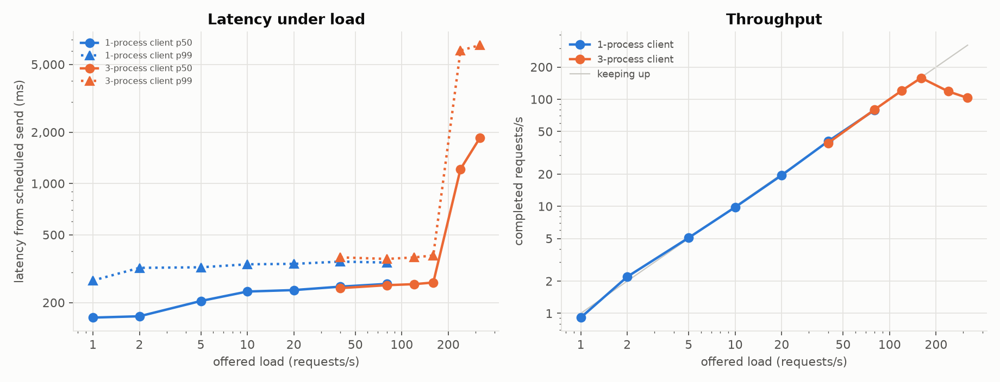

**Always check the server's own queue and utilisation before believing a load test's saturation point.**

## 5. Phase 3: Triton Inference Server

**Built:** `triton_models/model_repository/tabfm/` (Python backend) and `docker/triton.Dockerfile` (NGC 26.08 image plus
torch and tabfm; multi-arch, so arm64 runs on CPU and amd64 on the GPU).

- **Config** (`config.pbtxt`): `max_batch_size: 256` with the batch dimension = query rows; `dynamic_batching` with
  `max_queue_delay_microseconds: 0`; `instance_group` KIND_CPU (swapped to KIND_GPU at build time).
- **"Context as model."** The training table is fixed per Triton model and encoded in `initialize()`. Different
  tables become different models, managed through Triton's model-control API, so Triton's lifecycle management
  doubles as the context registry, with a batcher queue and metrics per context.
- **Explicit model control** (`--model-control-mode=explicit`): `POST /v2/repository/models/tabfm/load` with a
  config override **changed the instance count from 1 to 2 in 22.5 s, with no pod restart or image rebuild**.
- **Metrics on :8002** (`nv_inference_count`, `nv_inference_exec_count`, queue and compute durations,
  `nv_gpu_utilization`) showed the batching directly. Up to 80 req/s, 4,767 requests ran in 954 executions (~5
  requests per batch). They also located the bottleneck (§7).

**On CPU** (M4, fp32, plain Docker, 512 context rows × 4 members; details in [`local_phase.md`](local_phase.md)):
Triton was ready 51 s after `docker run` (weights 1.0 s from the exported checkpoint, context encode 45 s), agreed
with the FastAPI container to 7e-7, and kept up to 8 req/s with p50 3.0 s (FastAPI: 2.1 s). Both saturate by 16 req/s.
Batching was active on both (Triton 1,192 inferences in 204 executions).

## 6. Phase 4: KServe on Kubernetes

**Built:** `k8s/kind/` (local cluster), `k8s/kserve/` (CPU InferenceServices), `k8s/gke/` (GPU cluster, Cloud Build,
GPU InferenceServices, KEDA, bench and load-generator pods, teardown).

- **KServe v0.20 in Standard mode** (a raw Deployment + Service + autoscaler; no Knative or Istio in the request
  path), with cert-manager, KEDA and a minimal Prometheus.
- **Two ways to put the model behind KServe:**
  1. *Custom-container predictor* (`isvc-fastapi-*.yaml`): our FastAPI image. KServe adds storage, probes, the
     Service and the autoscaler.
  2. *ServingRuntime + InferenceService* (`isvc-triton-*.yaml`): Triton as a reusable runtime template, selected by
     model format. Code and config are in the image; **weights come from `storageUri`** (`pvc://` on kind, mounted
     without a copy; `gs://` on GKE, downloaded by the storage initializer).
- **Images built with Cloud Build** (native amd64, no multi-GB upload from a laptop). **Workload Identity** grants
  the pods read access to the weights bucket, with no service-account keys.
- **Autoscaling:** `serving.kserve.io/autoscalerClass: keda`, scaling on
  `avg(avg_over_time(ltm_inflight_requests[30s]))` scraped by Prometheus, target 8 in-flight requests per replica.
- **Single-GPU rollouts** need `deploymentStrategy: Recreate` (§10).

**kind (local, CPU fp32).** `k8s/kind/up.sh` builds the whole stack in 508 s (most of it loading the 28.5 GB Triton
image into the node). With weights on a hostPath-backed PVC (`pvc://`, mounted without a copy), both
InferenceServices went **apply → Ready in 66 s (FastAPI) and 71 s (Triton)**. Of that, ~56 s was context encoding on
CPU; weights took 1–2 s. Both return the same probabilities for the same request, and Prometheus scraped both. Under
load through `kubectl port-forward`, both kept up to 8 req/s, and **Triton's tail was clearly better** (p99 3.8 s vs
6.7 s at 8 req/s): its HTTP front end is C++, while FastAPI parses JSON in the same Python process that runs the
model. Full tables in [`local_phase.md`](local_phase.md).

**Cold start on GKE, from zero GPU nodes** (Triton InferenceService, timeline from pod events):

| Step | Time | Cumulative |
|---|---:|---:|
| Cluster autoscaler adds an L4 node (g2-standard-8) | 55 s | 0:55 |
| GPU device plugin ready, pod scheduled | 37 s | 1:32 |
| KServe storage initializer downloads 3.3 GB of weights from GCS | 45 s | 2:17 |
| **Container image pull (13.6 GB Triton + torch CUDA)** | **3 m 31 s** | 5:48 |
| Python backend + torch import | 39 s | 6:27 |
| Weights to GPU, context encode (1,024 rows × 8 members) | 25 s + 4.4 s | 6:57 |
| Ready | | **7:12** |

Image streaming was enabled, but the first pull of a freshly pushed image was still a full pull. A **warm restart**
(node up, image cached) took **~1 minute**. So scale-to-zero on GPUs means paying 1–7 minutes on the first request,
and the image is the largest part of that.

**Cold start, all measured variants** (apply → Ready on GKE, same context):

| Variant | Node | Image pull | Model init | apply → Ready |
|---|---|---|---|---|
| Triton eager, first deploy | new L4 (55 s) + GPU plugin (37 s) | 13.6 GB, 3 m 31 s | 39 s import + 25 s weights + 4.4 s encode | **7 m 12 s** |
| Triton eager, warm restart | already up | cached | same | **~1 min** |
| Triton compiled (reduce-overhead), 1 instance | already up | 13.6 GB, 3 m 17 s (new digest) | 26 s weights + 4.4 s encode + **1,372 s capture** | **28 m 11 s** |
| + 2nd instance via repository API (same pod) | – | – | 206 s (inductor cache on disk reused) | +3 m 26 s |
| FastAPI eager | already up | 4.7 GB | 20 s weights + 2 s encode | ~1 min |
| FastAPI compiled, slim image (CUDA 13 wheels dropped, gcc added) | already up | **4.0 GB, 2 m 05 s** | 21 s weights + 2 s encode + **1,221 s capture** | **23 m 53 s** |
| Triton eager, slim image | already up | **12.8 GB, 1 m 49 s** | 17 s weights + 2 s encode | **3 m 11 s** |

The lessons: the **image** dominates eager cold start (slim it, split weights out, stream it), and **compilation**
dominates compiled cold start (persist the cache). Weights loading and context encoding are small by comparison
on a GPU.

## 7. Phase 5: GPU serving on GKE

All runs: 1× L4, the same context (1,024 rows, 10 features, 8 members, bf16), 1-row requests over OIP v2, the
open-loop client running in-cluster. These are **eager** runs; compiled results are in §7.2.

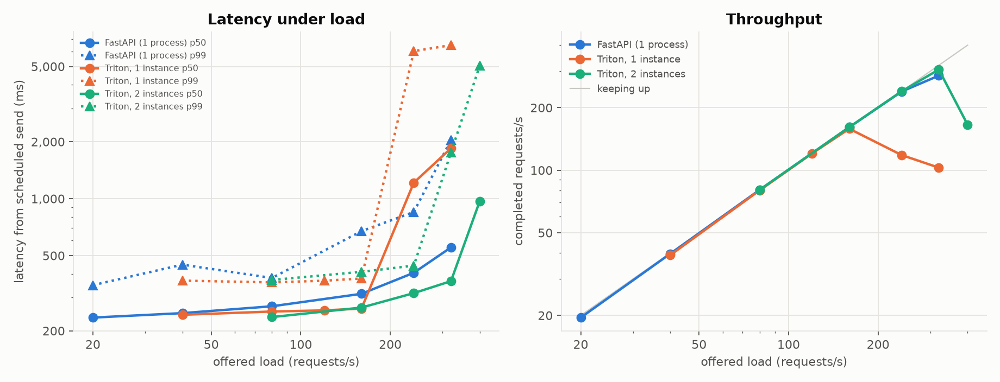

### 7.1 Eager: FastAPI vs Triton

| Stack (1× L4) | 80 req/s p50 / p99 | 160 req/s p50 / p99 | 240 req/s p50 / p99 | Knee |
|---|---|---|---|---|
| FastAPI, continuous batcher | 270 / 381 ms | 314 / 673 ms | 406 / 850 ms | ~285 req/s |
| Triton, 1 instance | 253 / 361 ms | 262 / 378 ms | collapses (118 req/s done) | ~160 req/s |
| Triton, 2 instances (same GPU) | 237 / 372 ms | 266 / 410 ms | **317 / 443 ms** | ~300 req/s |

Reading the table:

- **The Triton 1-instance bottleneck was host CPU, not the GPU.** At overload, `nv_gpu_utilization` was ~0.3 and the
  Triton pod used exactly one core. A Python-backend instance is one process with one GIL doing preprocessing plus
  thousands of kernel launches per batch. **A second instance on the same GPU doubled capacity** (18.8 of 23 GB used,
  leaving no room for a third).
- **FastAPI gets more out of one model copy** because its batcher forms large batches under load (25,225 requests
  in 995 batches, ~25 requests per batch, ~192 ms per batch). But HTTP/JSON handling and the model share one Python
  process, so **its tail latency is worse** (p99 673 ms vs 378 ms at 160 req/s).
- **Triton with 2 instances has the best latency at every load** at the cost of a second copy of weights and cache.
  With Triton, that trade-off is one config line.

### 7.2 Compiled serving

The same experiment after optimising the deployed system: `LTM_COMPILE_MODE=reduce-overhead` (torch.compile + CUDA
graphs, query rows padded to power-of-two buckets, every bucket up to `max_batch_size` = 256 captured in
`initialize()` before Triton reports READY). Same GPU, context, client and rates
(`k8s/gke/experiment-compiled.sh`).


| Triton on 1× L4 | 80 req/s p50 / p99 | 160 req/s | 240 req/s | 320 req/s | Knee |
|---|---|---|---|---|---|
| eager, 1 instance | 253 / 361 ms | 262 / 378 ms | collapses | – | ~160 req/s |
| eager, 2 instances | 237 / 372 ms | 266 / 410 ms | 317 / 443 ms | 366 / 1,754 ms | ~300 req/s |
| **compiled, 1 instance** | **85 / 117 ms** | **91 / 125 ms** | **99 / 137 ms** | **112 / 315 ms** | **~350 req/s** |
| compiled, 2 instances | 118 / 198 ms | 154 / 218 ms | 169 / 266 ms | 186 / 257 ms | ~320 req/s |

**FastAPI, compiled** (same slim image, `LTM_COMPILE_MODE=reduce-overhead`, 9 row buckets warmed up before the
startup probe passes):

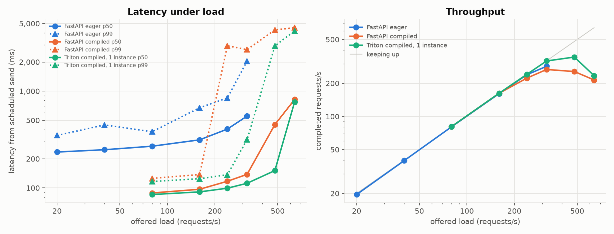

| FastAPI on 1× L4 | 80 req/s p50 / p99 | 160 req/s | 240 req/s | Knee |
|---|---|---|---|---|
| eager | 270 / 381 ms | 314 / 673 ms | 406 / 850 ms | ~285 req/s |
| **compiled** | **89 / 126 ms** | **97 / 137 ms** | 117 / 2,943 ms (223 req/s done) | **~230 req/s** |

Compilation gave FastAPI the same ~3× latency cut at low and medium load, but its knee **dropped**. During
overload the pod used **1.05 CPU cores**: one Python process doing JSON parsing, the asyncio event loop, pandas
preprocessing and batch bookkeeping. Once the GPU forward takes ~66 ms per batch (37,663 requests in 2,903
batches), that host work is the ceiling. Eager batches took ~190 ms and absorbed ~25 requests each, which hid
it. **Compiled Triton reached ~350 req/s on the same GPU** because its HTTP/gRPC front end and scheduler are C++
and the Python stub only receives tensors. At high throughput, keep request handling out of the model's Python
process.

What changed, and why:

- **3× lower latency and ~2× the capacity from the same GPU and a single instance.** Compilation removed the
  Python dispatch that had been the bottleneck.
- **The instance-count decision flipped.** In eager mode a second instance doubled capacity, because the limit was
  one GIL-bound host process. Compiled, the **GPU** is the limit, so a second instance only time-slices it: both
  instances form smaller batches and interleave their CUDA graphs. Two compiled instances were slower than one at
  every load. *The right number of model instances per GPU depends on where the bottleneck is, and moves when you
  optimise.* That's why it has to be re-measured after each change rather than set once.
- **The cost is cold start.** Capturing 9 row buckets took **1,372 s (23 min)** in the first Triton instance, so the
  pod was 28 min from apply to Ready. The second instance, loaded through the repository API into the same pod,
  took **206 s**, because inductor's on-disk cache from the first instance was reused. Persisting that cache
  (a volume or an image layer with pre-built artifacts) is what makes compiled replicas usable with autoscaling.

### 7.3 Autoscaling under load (KEDA)

With FastAPI at min 1 / max 2 replicas and a constant 240 req/s for 4 minutes:

- **+28 s:** KEDA saw ~33 in-flight requests per pod (target 8) and scaled the Deployment to 2.
- **+40 s:** the second pod was Pending, and the cluster autoscaler reported *"Node scale up … failed: GCE quota
  exceeded"* (the project's GPU quota is 1; the increase to 2 was denied).
- The single replica served **57,977 requests at 241 req/s, p50 408 ms, p99 825 ms, 48 dropped**, with in-flight
  requests holding at 43–56 per pod.

The autoscaling chain worked end to end (Prometheus metric → KEDA → HPA → pending pod → cluster autoscaler). **In
real GPU serving, the binding constraint is often capacity and quota, not the autoscaler config.** Capacity planning
(reservations, quota, fallback pools) is part of inference architecture.

## 8. Phase 6: inference architecture strategy

*Written as the decision doc I'd bring to a design review for "serve an in-context tabular model at p99 < X ms".*

**1. Treat context and weights as separate resources.** Weights are shared and immutable; contexts are per-tenant
and memory-heavy (~0.2 MB × rows × members). Cache memory, not request rate, sets GPU fleet size first. Put a byte
budget and LRU eviction on contexts (done in `engine.py`), and route requests by context id so a context's replica
already holds its cache.

**2. Encode once, serve many.** Make context registration an explicit, asynchronous operation (the one-off encode
takes seconds). Requests never re-encode. This single change is worth 2–74× depending on context size.

**3. Choose ensemble size from measured quality.** Default to the smallest member count that holds quality on the
real data, and batch all members in one forward.

**4. Remove Python from the hot path, in this order:** compile the forward with shape buckets and warm-up before
ready (4×); run more model instances per GPU than one GIL can feed; keep HTTP/JSON out of the model process
(Triton's C++ front end, or a separate API tier).

**5. Batch by default.** Exact for this model. Continuous batching with a small row cap; measure `max_queue_delay`
rather than guess it (at 0 ms, merging under load already gave 5–25 requests per batch).

**6. Pick the runtime per constraint:**

| Need | Choice |
|---|---|
| Lowest tail latency per GPU, multiple instances, metrics, model control, a protocol other tools speak | **Triton** (Python backend now; a TensorRT/ONNX path for the core forward later) |
| Kubernetes-native lifecycle, storage, autoscaling, canary, a standard protocol across runtimes | **KServe** in front of Triton (ServingRuntime) |
| Fastest iteration, custom logic (context registry API), fewest moving parts | FastAPI on KServe (custom container) |
| Batch scoring over warehouse tables | BigQuery `AI.PREDICT` (managed, no GPUs) |

**7. Plan cold starts and capacity explicitly.** GPU scale-from-zero took 7 minutes, with a 13.6 GB image as the
largest part. Keep `minReplicas ≥ 1` for latency SLOs, slim images (a separate model-weights layer or modelcar,
image streaming), and treat quota and reservations as part of the design, not an afterthought.

**8. A capacity model from the measurements** (1,024 context rows, 10 features, 8 members, 1-row requests, bf16,
one L4, compiled Triton with 1 instance):

- **Throughput per GPU at p99 < 150 ms:** ~240 req/s (p99 137 ms measured at 240 req/s; 315 ms at 320 req/s).
  With N+1 headroom, 1,000 req/s at p99 < 150 ms is **5 + 1 L4s**. No eager configuration meets that SLO at any
  fleet size (p99 ≥ 360 ms even at 80 req/s), and stock TabFM without the cache takes ~860 ms per request at this
  context size.
- **Contexts per GPU:** each such context caches 1,024 × 8 × ~198 KB ≈ **1.6 GB**. After weights (3.3 GB), CUDA
  graphs and allocator headroom, one 24 GB L4 holds roughly 8–10 of them. The context byte budget, not QPS, is the
  first limit for many-tenant serving, so shard contexts across replicas and route by context id.
- **Cold start for scale-out:** 3–7 min eager (image-dominated) and 28 min compiled without a persisted compile
  cache. Keep `minReplicas` at peak-minus-burst, and don't count on scale-from-zero for latency SLOs.
- **Cost side:** at roughly $0.85/h per on-demand `g2-standard-8` (1× L4) in us-central1 (check current pricing),
  that fleet costs about $5/h. The cache, batching and compilation are what make the SLO reachable at all; after
  that, per-GPU throughput sets the bill.

## 9. TorchServe and TensorFlow Serving

- **TorchServe** is archived (read-only since August 2025, no security fixes). The concepts carry over directly:
  its *handler* (`initialize` / `preprocess` / `inference` / `postprocess`) is this repo's Triton `model.py` and
  `CachedTabFMClassifier`; its `.mar` archive is the Triton model repository; its batching (`batch_size`,
  `max_batch_delay`) is Triton's `dynamic_batching`; its management API is Triton's model-control API. For new
  systems, Triton or KServe is the defensible choice, and knowing why is part of the answer.
- **TensorFlow Serving** serves TensorFlow SavedModels. TabFM also ships a JAX implementation that could in principle
  be exported via `jax2tf`, but its custom memory-efficient attention makes that a project of its own. The concepts
  map the same way: SavedModel signatures ↔ Triton `config.pbtxt` I/O, `--enable_batching` + batching parameters ↔
  dynamic batching, model version policies ↔ Triton model versions and KServe canaries.

## 10. Everything that went wrong

| Problem | Symptom | Fix / lesson |
|---|---|---|
| Another process on the laptop | Mac sweeps 2–7× slower; cached 1-row latency 879 ms instead of 128 ms | Check what else is running; keep contended results separate; re-run |
| Load-generator bottleneck | "Saturation" at 160 req/s while Triton's queue was empty and GPU 30% | Pre-serialised bodies, multi-process client; always read the server's queue and utilisation |
| Triton Python backend GIL | GPU ~30% utilised, pod at 1 core | Two instances on one GPU (2× capacity); compile to cut dispatch |
| Rolling update with one GPU | New pod Pending forever; autoscaler "GCE quota exceeded" | `deploymentStrategy: Recreate` for single-GPU workloads |
| KServe default CPU limit | `requests.cpu: 3 must be ≤ cpu limit of 1` on a custom-container predictor | Always set `limits.cpu` explicitly (it would otherwise also throttle silently) |
| GPU driver not found in `python:3.12-slim` | `RuntimeError: Found no NVIDIA driver` on GKE | `LD_LIBRARY_PATH=/usr/local/nvidia/lib64` (NVIDIA base images set it; slim images don't) |
| Prometheus crash loop | `global scrape timeout greater than scrape interval` | Set `scrape_timeout` below a short `scrape_interval` |
| Stuck Helm release | `UPGRADE FAILED … Progress deadline exceeded` | Uninstall the failed release, then reinstall |
| `torch.compile` in slim image | Triton kernels need a C compiler | Install `gcc` where compilation happens |
| bf16 on ARM CPU | 5–11× slower than fp32 | Choose precision per target |
| Synthetic task too easy | Accuracy flat at 97% for every ensemble size | Harder task (`class_sep=0.5`) plus log loss; it was still flat (a real finding) |
| Library default `batch_size=1` | Ensemble members run one by one | Batch all members: 5× on the L4 |
| Bare `Pod`s for bench/load jobs | GKE: *"Pod is blocking scale down because it's not backed by a controller"*; the L4 node could not scale to zero while an idle bench pod existed | Annotate `cluster-autoscaler.kubernetes.io/safe-to-evict: "true"` (or use Jobs) and delete them as soon as results are copied |
| CUDA 13 wheels in every image | `docker/requirements.txt` kept `nvidia-*`/`cuda-*` pins because the filter regex required `==` right after `nvidia-` | Fixed the filter (`docker/requirements.sh`): service image 4.7 → 4.0 GB, Triton 13.6 → 12.8 GB, pulls 3 m 31 s → 1 m 49 s |
| `triton/` directory in the repo root | `import triton` from the repo root picked up the directory and broke `torch._dynamo` | Renamed to `triton_models/` |
| Compiled FastAPI crash | `InductorError: Failed to find C compiler` | Install `gcc` in CUDA service images |
| Reused image tag | A redeploy would have run the previous image (tag unchanged, cached on the node) | `imagePullPolicy: Always` for mutable tags, or deploy by digest |
| Compile warm-up | 433 s to compile 9 shape buckets in a fresh process | Budget it in startup probes; persist the inductor cache |
| GPU quota request to 2 denied | No real 1 → 2 GPU scale-out | Documented the autoscaling chain up to the quota failure |

## Measurement caveats

- **L4 numbers are the reference.** Every GKE load test ran the client in-cluster, so there's no laptop-to-cloud
  round trip.
- **M4 numbers show trends, not SLOs.** The Mac had ~12 GB of swap in use and a busy Docker VM. Repeated clean runs
  of identical configs varied by up to ~2× (e.g. cached 16-row requests at 512 context rows: 256–501 ms).
- **bf16 "exactness"** means within the model's own batch-composition noise, with 100% label agreement. fp32 is
  exact to ~1e-6.
- **Synthetic data.** Latency depends on table shape, not content. Quality conclusions (ensemble size) are about
  these tasks only.

## Reproduce

```bash
uv sync --all-extras
uv run pytest -m "not slow" && uv run pytest -m slow           # harness/batcher tests; cache == stock TabFM
uv run ltm-serve bench context_scaling stages --device mps      # or --device cuda
uv run ltm-serve plots

k8s/kind/up.sh && kubectl --kubeconfig ~/.kube/ltm-serve --context kind-ltm apply -f k8s/kserve/isvc-fastapi-cpu.yaml
export PROJECT=<your-gcp-project-id>                            # GKE scripts read it (or the active gcloud project)
k8s/gke/up.sh                                                   # cluster, KServe, KEDA, Prometheus, Cloud Build
k8s/gke/run.sh k8s/gke/isvc-triton-gpu.yaml
k8s/gke/run.sh k8s/gke/job-loadgen.yaml NAME=triton URL=http://tabfm-triton-predictor.ltm.svc.cluster.local \
  MODEL=tabfm INPUT_NAME=ROWS RATES=40,80,160,240 PROCS=4 CLIENT_CPU=4 LOADGEN_POOL=l4
k8s/gke/down.sh                                                 # delete everything billable
```
